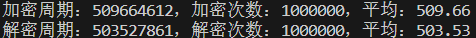
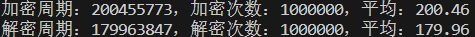
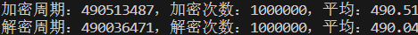
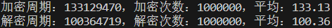

SM4是一种分组密码算法，其分组长度为128位（即16字节，4字），密钥长度也为128位（即16字节，4字）。其加解密过程采用了32轮迭代机制（与DES、AES类似），每一轮需要一个轮密钥（与DES、AES类似）

## 优化方式
SM4文件为基础实现。
SIMD文件通过4组数据并行处理
Unroll文件减少分支判断与循环
T-Table文件是结合查表优化与SIMD并行的方式

## 结果对比

最后我们将优化前和优化后的性能测试进行对比，如下图所示：

优化前：

SM4：

优化后：

SIMD：

Unroll：

T-Table：

